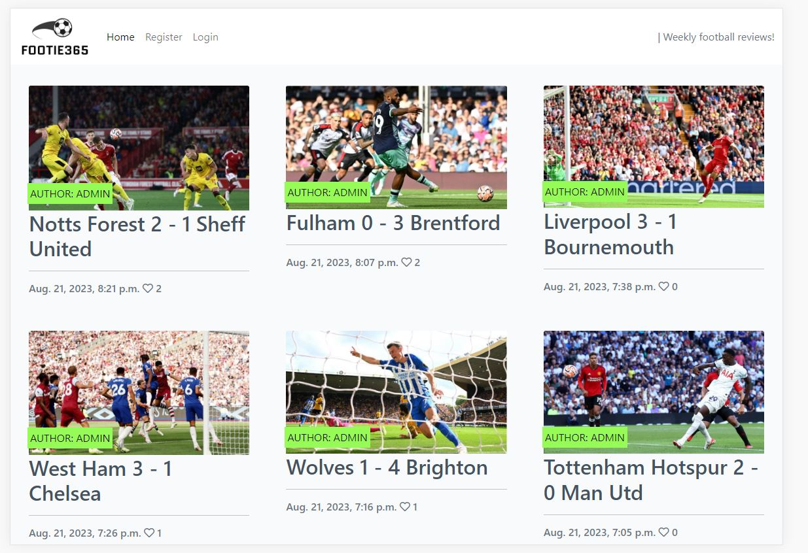
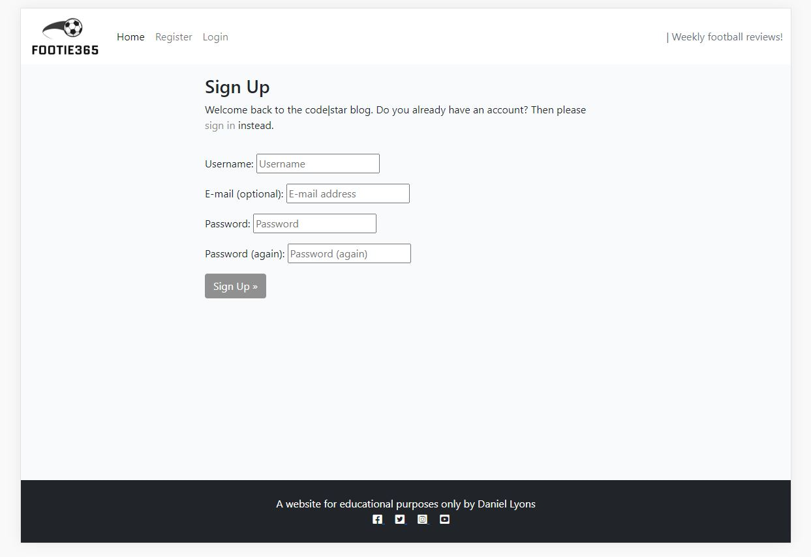
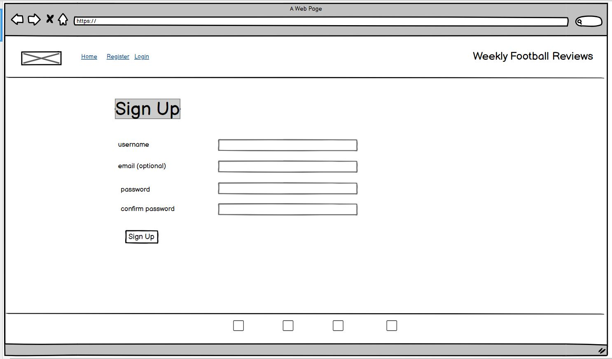

# Footie 365

Footie 365 is a web application blog designed for visitors to read reviews on recent high profiled football matches, comment on these matches and for users to interact with each other. Inspirational came from sports news sites, reddit and to a small extent Pintrest. 

Visitors to the site can read the reviews and there is a call to action with the register / sign up button on the top navigation bar of the site, where they will be taken to the sign up form requesting a username and password as mandatory fields with an option email address. After registering an creating an account the user can then proceed to log into the site and enjoy full benefits of becoming a member such as the ability to comment on the posts on the site, like or unlike posts and also the ability to interact with other members of the site in the comments section.

Users already registered can login upon landing on the homepage, which is a tidy grid of "match cards", containing a title and in some reports a sub-title underneath. The user can click to take them into the full macth report page where they have a form on the page to leave their comment. It is also where the user can like or unlike a match report. The User can create a comment, read other comments and the report, after liking a post if the user decides they've changed their mind they can update their like by unlikng a post.

Footie365's live site can be found here : [Footie365](https://https://footie365-3519eaeedcde.herokuapp.com/)

</br>


# Table of Contents
- [User Experience](#user-experience)
- [Features](#features)
  - [General](#general)
  - [Website Pages](#Website-pages)
  - [Registration](#accounts)
- [Design](#design)
- [Technologies Used](#technologies-used)
- [Testing](#testing)
- [Deployment](#deployment)
- [Credits](#credits)

# User Experience

### User Stories

- As a Site User I can view the home page where I can see the site's goal and also be encouraged to sign up
- As a Site User I can register for an account so that I can then log in to gain access to the site's features
- As a Site User I can log in and therefore I can gain access to the site's features
- As a Site User I can Log Out meaning someone else log in on my computer, change accounts or leave myself signed out on public devices
- As a Site User I can view the Home page when logged in so that I can view recent match reports
- As a Site User I can navigate betweens the different pages of blog reports
- As a Site User I can can create comments on various blog reports
- As a Site User I can like and unlike blog reports

- As a Site Administrator I can view administrator features so that I can add, edit and remove match reportson  the site
- As a Site Administrator I can view the blog CRUD forms so that I can create, add, edit and remove reports from the site
- As a Developer I can create a model for the match report database so that it is available for administrators to add new match blog reports and reviews


# Features
## General
### Navigation Bar

<details>
<summary>Navbar</summary>


</details>

The site's navigation bar is featured across all pages.

The navigation bar displays "Home", "Login" and "Sign Up" for all unregistered visitors to the site as well as to registered members who are logged out. When viewing the site on a smaller screen such as on a mobile, the navibar collapses froma  list to a hamburger menu which when clicked toggles the list in and out of view for the user.

When a regsitered user is logged into the site they will see both the home page and logged out option on the navbar.

This narbar is based on "navbar-expand-lg navbar-light bg-white" from Bootstrap.

The logo can also be seen on the navbar and when clicked from any part of the site will always bring the user quickley back to the home page, as it's an index page link. This logo was made with Designevo's Logo generator, details of which are discussed further down this report.

### Footer

<details>
<summary>Footer</summary>


</details>


Just like the navbar, the footer is featured across all of the site's pages. It contains social media icons which are also clickable links to their respected site's homepage. When Footie365 moves on from the MVP stage these will take the user to proper social media pages of Footie365. Here in the footer the user can also see that the site is currently just for educational purposes only.

## Website Pages


### Index Page

<details>
<summary>Home Page Unregistered</summary>


</details>

<details>
<summary>Home Page Logged In</summary>


</details>

Depending on the type of user viewing the index page it can have two different states (Logged in / Logged Out).

New users to the site, and users who are logged out, will see a batch of card blogs on display on the home page. These are neatly and clearly laid out and the user can instantly recognise what kind of a site Footie365 is upon landing on the home page, incase they hadn't already gussed form the site's name and the images used for each blog report on the home page. Layered over these images is a container banner stating who wrote the blog and underneath the image is the match's scoreline for both teams and this is a clickable link which will take the user to a new page where they can read the full match report.

All of these pages as well as the home page are responsive and will displays different amounts of match report cards on screen depending on the size of the user's device, such as 3 blog reports on a wide desktop screen or 1 single report one underneath another ona  smaller mobile device screen.

### Individual Match Blog Reports

<details>
<summary>Match Reports</summary>


</details>

When a iser clicks ona  match title on the home page they will be taken to a new page with the full blog report write up for that specific game. 

For users who are registered and are logged in they can interact with this match report content by liking or unliking the blog reports. Logged in users can also interact with other users here by commenting on blog reports.
These pages are also repsonsive and will change to suit the user's device screen width. All content is contered to keep a good design look to the site.

## Accounts

### Registration Page

<details>
<summary>Registration Page</summary>


</details>

Through the call to action 'Sign Up' link on the navbar users can access the registration page, where they can create an account. The sign up form has been kept as simple as possible so as not to discourage users from signing up. The user is asked to create a username, a password which they must repeat to make sure they have entered it correctly, and also an optional email address.

When a user creates an account they are automatically taken to thehome page where they can seee that they are now logged in as the login option will have changed to logout.

### Login Page

<details>
<summary>Login Page</summary>


</details>

The user can find the log in page by clicking the link in the navbar. The user will be presented with a simple form requesting their username and password.


### Sign Out Page

<details>
<summary>Sign Out Page</summary>

After the user successfully logs in they will be taken back to the index page again where they can choose which match report blog they would like to view.


</details>

When the user is finished on the site they can choose to log themselves out of the site with the call to action link button on the navbar "log out". This will bring the user to a log out form where after logging out successfully they will be once again brought back to the home page.

## Admin Panel

### Admin Panel

<details>
<summary>Admin Panel</summary>

- From within the admin panel the administrator is able to create, update and delete match reports.


</details>

<details>
<summary>Admin Approve Comments</summary>

- The administrator can also approve pending comments created by registered user of the site as seen below.


</details>


### Create Comment

<details>
<summary>Create Comment</summary>

- The user can create a comment in the input text field as seen below and then click the submit button to send the comment for the administrator's approval.


</details>


## Future Features
1. _For future updates to the site a proper admin panel on the site will be implemented so the user can create their own match report 
    cards following on form their ability to create comments already.
2. _More work will be done to the implement the colour theme further.
3. _The like button will change to a love button and thumbs up and thumbs down icon buttons will be beside the love button so users can 
    love a post as well as like or dislike a post. This will enable poor match reports to show negative ratings


# Design

Footie365 has a simple blog style with inspiration taken from Reddit and Pintrest. The match report cards are laid out clearly and and it's very intutive for the user to grasp how to use the site right away after landing on the home page. There are no distractions, just the information on a clear display. Once the user is signed in the functionality is straight forward to owing to the simple design.


## CRUD Functionality

- The user once registered can create their own posts and comments to posts.
- Any user can read all match reports
- The user can update or edit any previous posts which they have already created.
- The user can later delete a previous posts of theirs.


## Colour

- After digging around trying to find a suitable colour theme I found one that I felt fitted what the goal of this project was. The colour theme is from Shutter Stock and can be found here [Colour Theme](https://www.shutterstock.com/blog/sports-color-palettes-branding-marketing). Colours used:

- #97FB57 (a bright green) 
- #121212 (a dark grey / light black) 
- #909090 (a grey) 
- #F6F2F2 (a baige colour)

</br>


</br>


## Typography

The "Lato" font from google font is used in this site as well as "Roboto".


## Wireframes

Using the Balsamiq software I created wireframes during the inital planning phase of this project. These were to get my design down from head to paper / screen, and to see roughly what my template would look like. Below are screen shots of my wireframes created for both desktop and mobile versions before the website build.


<summary>Home Page Wireframe</summary>


<details>
<summary>Sign Up Desktop</summary>


</details>

<details>
<summary>Content Page Desktop</summary>


</details>

<details>
<summary>Sign Out Desktop</summary>


</details>


#### Mobile Wireframes

<details>
<summary>Mobile Home Page</summary>


</details>

<details>
<summary>Mobile Sign Up</summary>


</details>

<details>
<summary>Mobile Sign In</summary>


</details>

<details>
<summary>Mobile Content Pages</summary>


</details>

<details>
<summary>Mobile Sign Out</summary>


</details>


## Agile Design Methodology

[Github Projects Page](https://github.com/users/chancandan/projects/6)

For the planning and during the development of this website, Github Projects was to track the different user stories and monitor their progress to completion. It was hoped to have seperated The project's tasks and user stories into different epics and then completed during differnt sprints. However, life really got in the way during this project and I had to try to complete everything in one giant sprint. I do understand though, the importance of EPICs and sprints, and I did use the MOSCOW theory in my issues with must haves for the MVP, could haves for extended functionality and may haves for future stretch goals and targets.


## Enity Relationship Diagram

Using [draw.io](https://www.drawio.com) an enity relationship diagram (ERD) was created for this project. It was an important step in database design for understanding the relationships in the project between modals. Below is an image of this ERD.


# Technologies Used

- [HTML5](https://en.wikipedia.org/wiki/HTML5): mark-up language used.
- [CSS3](https://en.wikipedia.org/wiki/CSS): For website styling.
- [JavaScript](https://www.javascript.com/): Programming language used.
- [Python 3](https://www.python.org/): Programming language used.
- [Django](https://www.djangoproject.com/) Framework
  - [Django Crispy Forms](https://pypi.org/project/django-crispy-forms/): used for forms.
  - [Crispy Bootstrap5](https://pypi.org/project/crispy-bootstrap5/): Bootstrap5 template pack in crispy forms.
- [Bootstrap](https://getbootstrap.com/): Used for styling.
- [Cloudinary](https://cloudinary.com/): Used tostore static and media files.
- [GIT](https://git-scm.com/): Used for version control.
- [GitHub](https://github.com/): Used for host repository.
- [Gitpod](https://www.gitpod.io/): Online IDE used.
- [Heroku](https://www.heroku.com): Cloud app platform used.
- [Google Fonts](https://fonts.google.com/): Used to import fonts.
- [Font Awesome](https://fontawesome.com/): also used to import icons.
- [Balsamiq](https://balsamiq.com/): Application used to create wireframes.
- [Diagrams.net](https://www.diagrams.net/): used for Entity Relationship Diagram.
- [Snipping Tool](https://support.microsoft.com/en-us/windows/use-snipping-tool-to-capture-screenshots-00246869-1843-655f-f220-97299b865f6b): used for screenshots used in this readme. 

# Testing

To read about the testing carried out for this site, please click the below link;

[Link to TESTING.md](TESTING.md)

# Deployment
## Steps to deploy the site using Heroku:
- After having installed the following; psycopg2, dj3-cloudinary-storage, dj_database_url and gunicorn
- Use the Heroku dashboard to select "New" and then click to "Create a new app"
  - Must create app with a new unique name - this then needs to be added in the project settings to allow hosts
  - Select your specific region
  - Then click to "Create app"
- Next, go to the Resources tab:
  - In the add-ons search bar search for 'postgres' and then select 'Heroku Postgres'
  - Then click to 'Submit order form'
- Next go to the settings tab
  - In the 'Config Vars' section select 'Reveal Config Vars'
  - Add Heroku Postgres and set the DATABASE_URL and slo copy to the project
  - Create a SECRET_KEY and add a new config var for this
  - From Cloudinary's dashboard, copy the API Environment variable and add a new config var for CLOUDINARY_URL remembering to remove "CLOUDINARY_URL" from this
  - Add another config var DISABLE_COLLECTSTATIC witha  value of 1 - this will have to be once again removed before deployment
- For the project's environemnt variables;
  - In the top level directory create a new env.py file
  - In this en.py file;
    - Import os
    - Add 'os.environ["DATABASE_URL"] = "From the Heroku app paste the DATABASE_URL here"'
    - Add 'os.environ["SECRET_KEY"] = "New secret key should be pasted here"'
    - Add 'os.environ["CLOUDINARY_URL"] = "Paste the same  CLOUDINARY_URL from the Heroku app here"'
  ```
  import os

  os.environ['DATABASE_URL'] = 'postgres://exampledatabaseurl'
  os.environ['SECRET_KEY'] = 'examplesecretkey'
  os.environ['CLOUDINARY_URL'] = 'cloudinary://examplecloudinaryurl'
  ```
  - If not already present, create a .gitignore file and add env.py to it

- In your project, in settings.py:
  - Import os
  - Import dj_database_url
  - if os.path.isfile('env.py'):
	import env
  ```
  import os
  import dj_database_url
  if os.path.isfile('env.py'):
      import env
  ```
  - Replace the insecure secret key with "SECRET_KEY = os.environ.get('SECRET_KEY')"
  ```
  SECRET_KEY = os.environ.get('SECRET_KEY')
  ```
  - Link new database by commenting out old DATABASES section and adding:
	DATABASES = {
			'default': dj_database_url.parse(os.environ.get('DATABASE_URL'))
			}
  ```
  DATABASES = {
        'default': dj_database_url.parse(os.environ.get('DATABASE_URL'))
    }
  ```
  - Add Heroku to the allowed hosts: "ALLOWED_HOSTS = ['the_app_name_from_heroku.herokuapp.com']
  ```
  ALLOWED_HOSTS = ['example-heroku-app-name.herokuapp.com', 'localhost']
  ```
  - Add 'cloudinary_storage' (above 'django.contrib.staticfiles') and 'cloudinary' (below) to INSTALLED_APPS
  ```
  ...
  'cloudinary_storage',
  'django.contrib.staticfiles',
  'cloudinary',
  ...
  ```
  - Setup Cloudinary to store static and media files
   ```
    STATIC_URL = '/static/'
	STATICFILES_STORAGE = 'cloudinary_storage.storage.StaticHashedCloudinaryStorage'
	STATICFILES_DIRS = [os.path.join(BASE_DIR, 'static')]
	STATIC_ROOT = os.path.join(BASE_DIR, 'staticfiles')

	MEDIA_URL = '/media/'
	DEFAULT_FILE_STORAGE = 'cloudinary_storage.storage.MediaCloudinaryStorage'
  ```
  - Run 'python3 manage.py collectstatic' to collect static files
- In your project:
  - Create a Procfile in the top level directory and add 'web: gunicorn project_name.wsgi' to tell 
  ```
  web: gunicorn project_name.wsgi
  ```
  - Create a requirements file with 'pip3 freeze --local > requirements.txt' for Heroku to install required packages
  ```
  pip3 freeze --local > requirements.txt
  ```
  - Make migrations with 'python3 manage.py migrate'
  ```
  python3 manage.py migrate
  ```
  - Commit and push to GitHub
- Prior to final deployment:
  - Set DEBUG = False in project settings.py
  - Remove DISABLE_COLLECTSTATIC config var from Heroku
- Go to the Deploy tab:
  - Select GitHub and confirm connection to GitHub account
  - Search for the repository and click "Connect"
  - Scroll down to the deploy options
  - Select automatic deploys if you would like automatic deployment with each new push to the GitHub repository
  - In manual deploy, select which branch to deploy and click "Deploy Branch"
  - Heroku will start building the app
- The link to the app can be found at the top of the page by clicking "Open app"

Footie365's live site can be found here: [Footie365](https://footie365-3519eaeedcde.herokuapp.com/)

## Steps to clone site:
- In the GitHub repository, click the "Code" button.
- Select "HTTPS" and copy the URL.
- Open Git Bash and navigate to the repository where you would like to locate the cloned repository.
- Type "git clone" followed by the copied URL.
- Press enter to create the clone.
- Install required packages with the command "pip3 install -r requirements.txt"

# Credits
## Development / Code
- Code has been taken from bootstrap and from the "I think therefore I Blog" walkthrough by code institute. This walkthrough thought me how to go about setting up a blog app.

## Media
- Images are from BBC Sport's site and all copyright and credit remaains with them for the use of these images. These images are only included for educational purposes. [BBC Sport](https://www.bbc.com/sport)
- Icons are from [Font Awesome](https://fontawesome.com)
- Logo created with [Designevo's Logo generator](https://www.designevo.com/apps/logo/?name=black-and-white-football-icon)


## Acknowledgement
- My class have been great in supporting each other during project 4 and great content and help has been posted in our slack channel and when help has been needed it has always been discussed and solutions offered.


