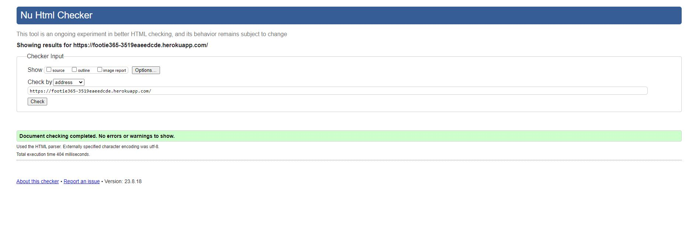
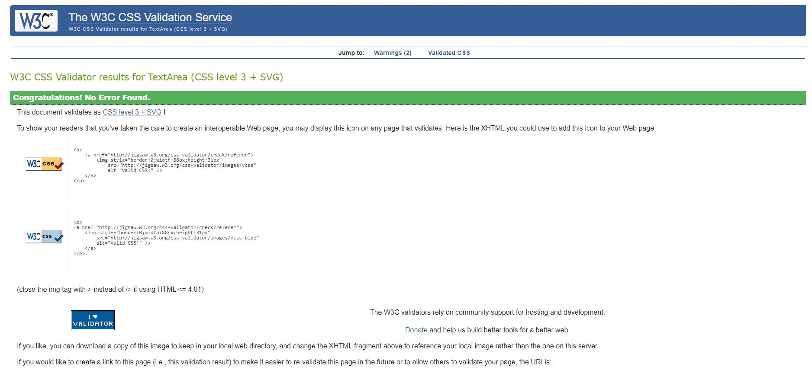

# Testing

## [HTML Validator](https://validator.w3.org)

Each page's HTML source code was validated by being copied and pasted into validator

Home Page Results

   

## CSS Validation  

[CSS Validation](https://jigsaw.w3.org/css-validator) was used to validate the CSS code in this project, no errors were found or reported.

CSS Validation

   

