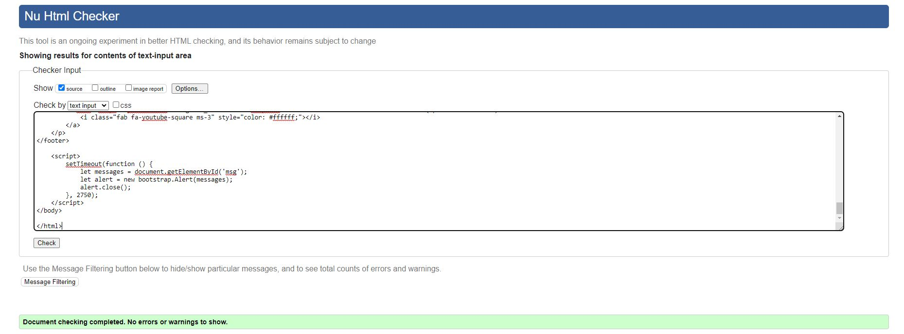

# Testing

## [HTML Validator](https://validator.w3.org)

Each page's HTML source code was validated by being copied and pasted into validator

Home Page Results

   

Register / Sign Up Validation

   

Sign In Validation

   

Sign Out Validation

   

## CSS Validation  

[CSS Validation](https://jigsaw.w3.org/css-validator) was used to validate the CSS code in this project, no errors were found or reported.

CSS Validation

   

## JavaScript Testing

JSHint was used for validating the JavaScript for the modals.

## Python Testing

Using Code Institute's own Python Linter, this project's code has been checked to make sure it is up to Pep8's python code guidelines.. [CI Python Linter8](https://pep8ci.herokuapp.com/) 

Before linter Validation

   

   
After Linter  Validation

   

## Lighthouse

Inside Google Chrome's DevTools I used Lighthouse to check the website's performance, SEO, best practices and accessibility.Below are some screenshots of Footie365's performance results.

Home Page - Not Signed In

The first initial testing was not bad. Best practices and accessibility scored really well. SEO wasn't bad but could be improved upon, however, this has not been covered in the course yet so it will have to go into a could-do issue for the site's development. Performance is just about adequate and will need looking at provided there is time before the project's MVP deadline. Given more time I'm confident I can increase the performance of the site. For now as a MVP this score isn't bad.

Sign Up Page

Sign In Page

Sign Out Page

## Manual Testing

Behaviour Driven Development (BDD), is a process used to test user stories in a non-technical way, meaning any user can test an app's or website's features.

### User Story Testing
 

- As a Site User I can visit the homepage where I can see the website's function and be encouraged to register

Test Results

The register link / button is clearly visible and the website's goal is conveyed by the nature of the featured images on the homepage, as well as the logo. Therefore, this passes its test.

 

- As a Site User, I can sign up to register for an account, so that I can sign in to gain access to the website's features

Test Results

This passes testing because the registration form is clear,easily accessible and it is easy to understand..

 

- As a Site User I can sign in to my account so that I can gain access to the app'ss features

Test Results

This passes the testing because the sign in form is clear, easy to access and only requires 2 credentals. 

 

- As a Site User I can Sign Out so that I can leave myself signed out on public spaces, change accounts or allow someone else sign in on the same device. 

Test Results

This passes its test because the sign out function is accessible, easy to find and easy to comprehend.

 

- As a Site User I can navigate to and view the Home page when signed in so that I can choose a match report to read.

Test Results

This passes testing because you are automatically redirected to the Home page after signing in and also always have the option of clicking the Footie365 logo or the "Home" option on the navbar to get there. Once there the user can choose which match report they would live to read.

 

- As a Site User I can hover over a match report, click it and be brought to that match report view page where I can read the full report.

Test Results

 
 

This passes testing because when the user hovers over the match report title the colour changes on hover to a darker shade of black. Once clicked the user is brought to the match report view page. These actions can both be seen in the below screenshots.

## Browser Compatibility

Footie365 was tested on the following broswers and without any issues;

- Chrome 
- Firefox 
- Edge 
- Safari 

## Bugs

:arrow_left: [Return to README document](README.md)

